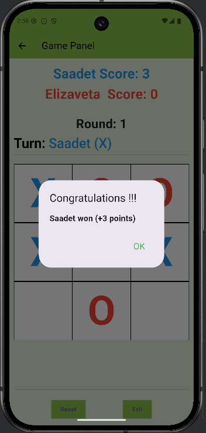
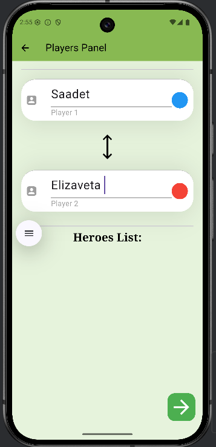
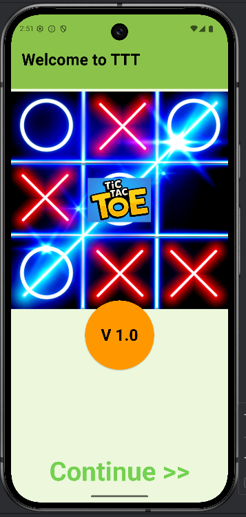

# TicTacToeGame

## Description
This is a simple Tic-Tac-Toe game implemented in Flutter.  
Two players take turns marking the spaces in a 3×3 grid with X or O.  
The player who succeeds in placing three of their marks in a horizontal, vertical, or diagonal row wins the game.

## 🛠️ Features
- Two-player gameplay (player vs player)
- Input validation to ensure valid moves
- Detects win, draw, and ongoing game states
- Simple and user-friendly interface

## 📂 Project Structure

lib/
├── main.dart                 # App entry point  
├── pages/
│   ├── welcome_page.dart     # Welcome screen UI  
│   ├── login_page.dart       # Player name input page  
│   └── game_page.dart        # Main game UI and logic  
├── widgets/
│   └── game_tile.dart        # Individual tile widget for the board  
└── utils/
    └── game_logic.dart       # Functions to check win conditions, reset game, etc.

## 🎮 How to Play
1. Run the game.  
2. Players take turns to enter their move by specifying the grid position.  
3. The game checks for a winner or a draw after each move.  
4. The game ends when one player wins or all positions are filled resulting in a draw.

## Screenshots
 <!-- Add your screenshot path -->
  <!-- Add your screenshot path -->
  <!-- Add your screenshot path -->

  
  
  

## 🤝 Contributing

If you'd like to contribute to this project, please follow these steps:

1.  Fork the repository.
2.  Create a new branch for your feature or bug fix.
